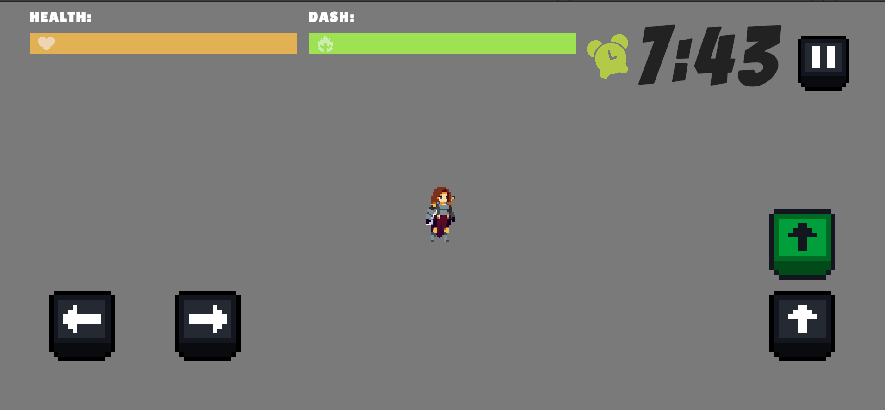
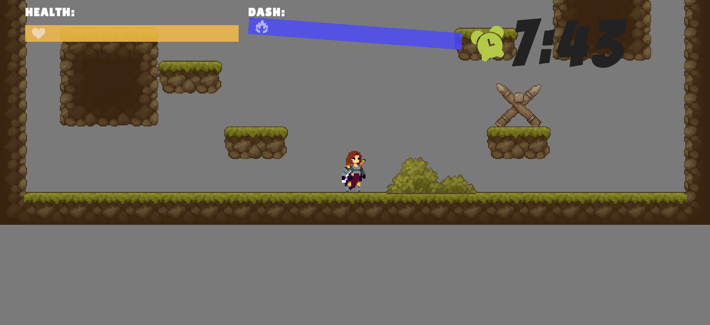
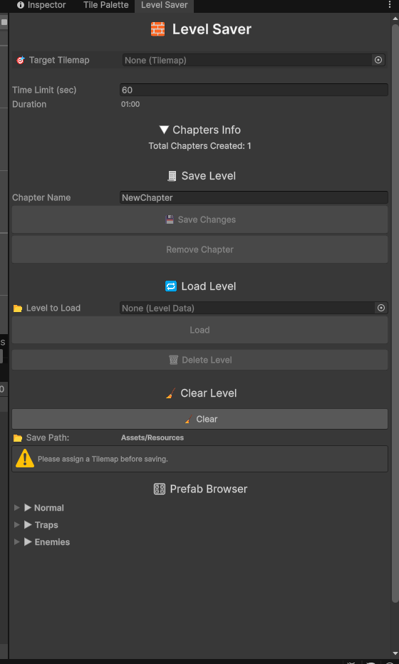

🎮 Hyper Step – Open Source 2D Platformer

Hyper Step is an open-source 2D platformer developed with Unity. The project focuses on clean architecture, gameplay programming, and editor tooling while documenting the entire development process through a public devlog series.

Designed with a cross-platform approach, the game is optimized for both PC and mobile platforms, making it easy to expand to additional platforms supported by Unity.

The goal of this project is to serve as both a playable game and a learning resource for Unity developers interested in game architecture and workflow.

> **Built with:** Unity 6, C#, DOTween, ScriptableObjects, Architecture

---

## 📺 Development Devlogs

Follow the complete development journey on YouTube:

**YouTube Playlist:**
https://www.youtube.com/watch?v=YAFqjKi3qeU&list=PLyjT6zzZrodjZgE11ABpBXwN-6MebG2A-

**ITCH.IO**
https://muhammeddemir06.itch.io/hyper-step

---

## Features

* Player movement
* Dash system 
* State Machine based player controller
* Dynamic level loading
* Custom Level Editor
* ScriptableObject-based level data
* Countdown timer system
* Enemy system
* Camera shake effects
* DOTween UI animations
* Event-driven UI architecture
* Manual Dependency Injection (Manual DI)

---

## Screenshots

### Mobile POV:

### Pc POV:

### Level Editor POV:

---

## Project Structure

The project is built around a modular architecture to keep gameplay systems separated and maintainable.

Some of the main systems include:

* State Machine architecture
* Dynamic level loading
* Custom editor tools
* ScriptableObject workflow
* Event-driven communication
* Manual Dependency Injection

---

## Unity Version

**Unity 6000.0.47f1**

---

## Contributing

Contributions, bug reports, feature suggestions, and feedback are always welcome.

If you have ideas for improving the project, feel free to open an issue or submit a pull request.

---

## License

This project is licensed under the MIT License. See the **LICENSE** file for more information.
